# (APPENDIX) Appendix {-} 

# VSTS Release Agent Setup

## Background

This chapter outlines how to set up the Data Science RD Farm (or any other machine) as an agent on Visual Studio Team Services (VSTS).

This will allow for continuous deployment pipelines to be set-up using VSTS Build and Release functionality and negates the need for manual copying or cloning of repositories to the RD farm to deploy. 

## Process

1. Add R to the PATH of the DS RD Farm
2. Create a new Agent Pool
3. Download the Agent
4. Move the Agent files to the DS RD Farm
5. Create a new Personal Access Token
6. Configure the Agent on the RD Farm
7. Run the Agent

### Add R to the Path of the RD Farm

- Log onto the Data Science RD Farm
- Add R to your path variable:

```sh
setx PATH '/c/Program Files/R/R-3.4.2/bin'
```

### Create a New Agent Pool

- On your VSTS Project, select 'Agent Queues' from the menu under the cog icon

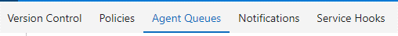

- On the Agent Queues page, click 'New queue...'

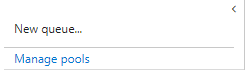

- Give your Agent Pool a name (e.g. DS-RD-FARM)

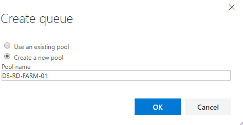

### Download the Agent

- At the top of the page, click the 'Download Agent' button

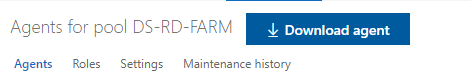

- On the next window, click 'Download'

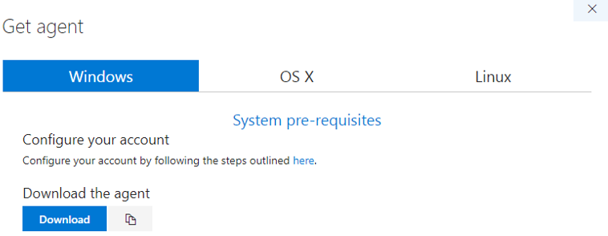

- This will download a zip file

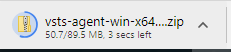

### Move the Agent to the DS RD Farm

- Cut and paste the entire zip folder to a suitable location on the DS RD Farm (Needs to be via a login that has publishing rights to the RSConnect Servers).

- Open the zip file and click 'Extract All'

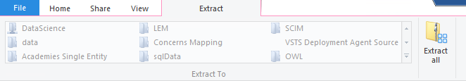

- Provide a suitable folder name such as VSTS-RELEASE-AGENT or DS-RD-FARM-01

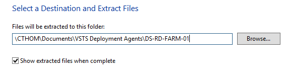

### Create a new Personal Acceess Token

- Back on VSTS, go to the 'Security' page of your profile

- Click Add

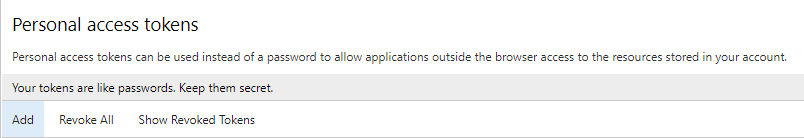

- Give it a name, and set it to expire in a long time (otherwise you'll need to keep renewing and reconfiguring your agents).

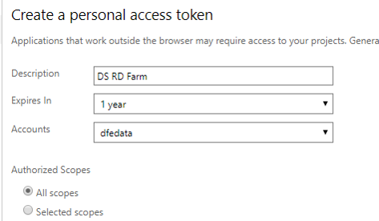

- Copy it to the clipboard! Note: you cannot only see the token at this point and not at a later date so safest to email it to your-self for now, so you've definitely got it!

### Configure the agent

- Open the agent folder you created on the RD farm and open the 'config file'

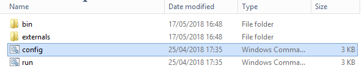

- This will open up a powershell terminal

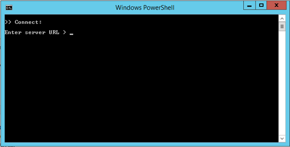

- Enter the URL of the VSTS Instance e.g. https://dfedata.visualstudio.com

- Press enter to use PAT authentication

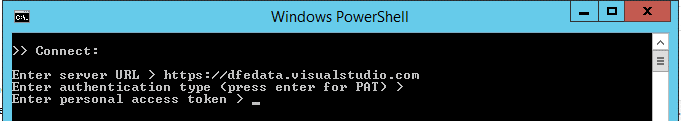

- Paste your personal access token in, and press enter


- Type in the name of your Agent Pool (created in step one)

- Give your agent a name - this could be anything, but makes sense to use the same name as the folder you put the files in (DS-RD-FARM-01 in this case).

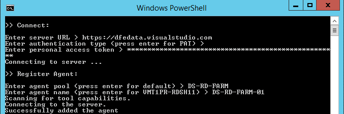

- Press enter to use the default setting of the '_work' folder

- Enter Y to run the agent as a service

- The PowerShell terminal will vanish and you've finished configuring

- Back on VSTS (Agent Pools tab), you should see the agent as offline

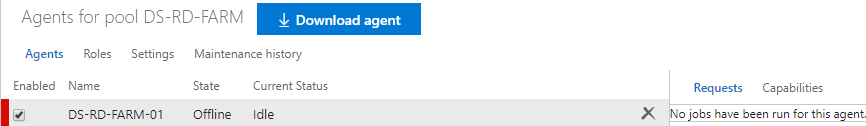

### Run the agent

- On the RD Farm, open the 'run' script in the Agent folder; it will say it is listening for jobs

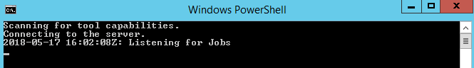

- On VSTS, you should now see your Agent as online (need to refresh the browser).

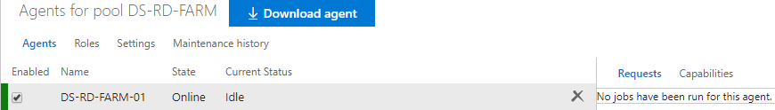

## Conclusions and Next Steps

You've now set up the DS RD Farm as a release agent, which means it can be used to perform automated actions, such as deploying shiny apps.

To create an automated release pipeline using this agent, you'll need to go to the Build and Release tab of VSTS and create a new release definition, walking through the steps there.
  
For deploying shiny apps, you'll need:

- An 'Agent Phase', where you tell the release to use the Agent Pool.

- A PowerShell task, where you tell the Agent what code to run.

In this case, the agent will run a single line of R code, using the rsconnect::deployApp() function.


